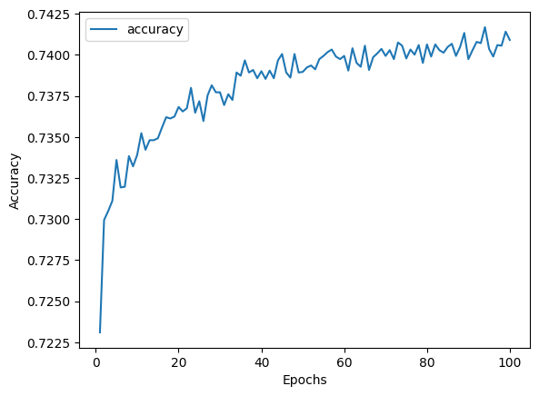
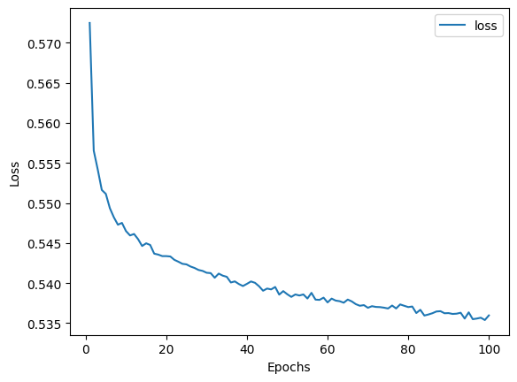

# deep-learning-challenge

## Overview
The purpose of this analysis was to employ neural network models to create a binary classifier in order to predict the success of aplicants that are funded by the non-profit
foundation Alphabet soup. The dataset contains the record of 34,000 organizations that received funding from the organization. The columns in the dataset are the features that
are to be analyzed to predict the success outcome of an organization.

## Results
### Data pre-processing
- Column "IS_SUCCESSFUL" is the target variable
- For the original model, the features were: APPLICATION_TYPE, AFFILIATION, CLASSIFICATION, USE_CASE, ORGANIZATION, STATUS, INCOME_AMT, SPECIAL_CONSIDERATIONS, and ASK_AMT. 
- For optimization, column "STATUS" was later dropped from the feature list.
- The identity variables "EIN" and "NAME" were removed from the feature list.

### Compile/Train/Evaluate models
The original model had 3 layers. Layer 1 had 80 neurons, layer 2 had 30 neurons and the putput layer had 1 neuron. Both the former layers had relu activation functions and the
output layer had sigmoid function. The model summary was provided in the starter_code; therefore, these parameters were used. The accuracy was 72.72% and loss was 56%. The 
training curves are shown below.

NOTE: 
I have worked on this challange myself. I did not seek help from anyone, or the Learning Assistant. However, I followed the class examples.