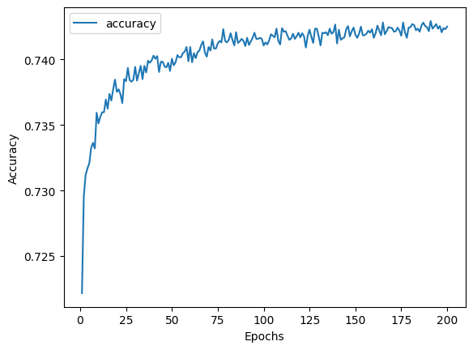
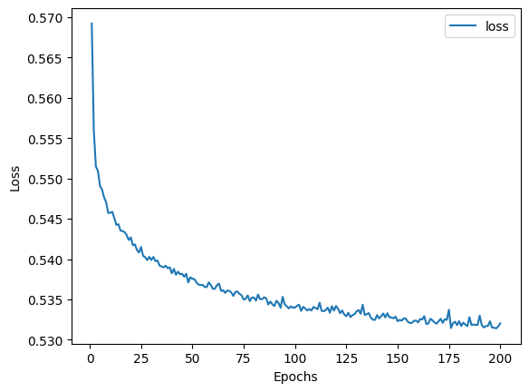
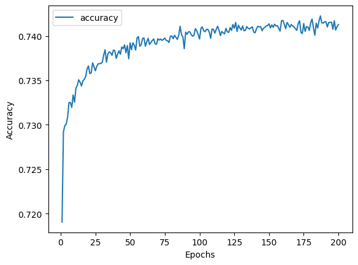
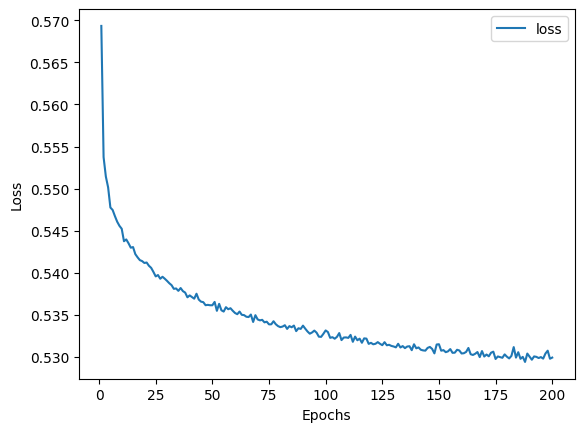
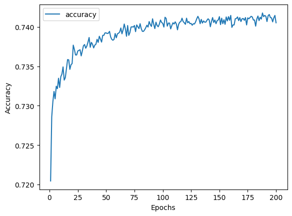
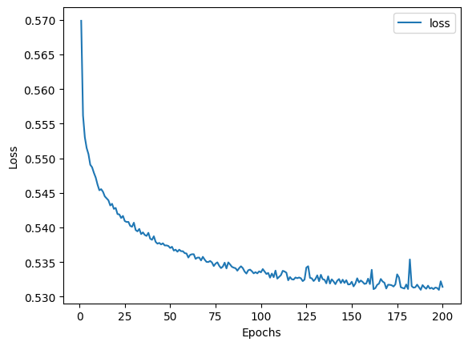

# deep-learning-challenge

## Overview
The purpose of this analysis was to employ neural network models to create a binary classifier in order to predict the success of aplicants that are funded by the non-profit
foundation Alphabet soup. The dataset contains the record of 34,000 organizations that received funding from the organization. The columns in the dataset are the features that
are to be analyzed to predict the success outcome of an organization.

## Results
### Data pre-processing
- Column "IS_SUCCESSFUL" is the target variable
- For the original model, the features were: APPLICATION_TYPE, AFFILIATION, CLASSIFICATION, USE_CASE, ORGANIZATION, STATUS, INCOME_AMT, SPECIAL_CONSIDERATIONS, and ASK_AMT. 
- For optimization, column "STATUS" was later dropped from the feature list.
- The identity variables "EIN" and "NAME" were removed from the feature list.

### Compile/Train/Evaluate models
The original model had 3 layers. Layer 1 had 80 neurons, layer 2 had 30 neurons and the putput layer had 1 neuron. Both the former layers had relu activation functions and the
output layer had sigmoid function. The model summary was provided in the starter_code; therefore, these parameters were used. The accuracy was 72.72% and loss was 56%. The 
training curves are shown below.

In optimization model 1, everything from the original analysis remained the same, but the model architecture was modified. It contained 5 layers. The 4 layers from the start
comprised 80, 50, 30 and 15 neurons, respectively, and each had the relu activation. The output layer was still 1 neuron with sigmoid activation. Accuracy was 72.57% and loss 
was 58.17%. Followings are the training curves.

In model 2, several modifications to the preprocessing steps were done in addition to the model architecture. First, column "STATUS" was also dropped. Bin size less than 700
was changed to Other, and classification less than 500 was changed to Other. The NN model had 4 layers, and the first three had 80, 40, and 20 neurons, respectively with relu
activation. The output layer was the same. Accuracy was 72.98% and loss was 57.30%. Below are the training curves.

Model 3 also had "STATUS" dropped from the feature list, bin size less than 1000 was turned to Other and classification size less than 100 was turned to Other. The NN model also
had 4 layers with 60, 80, 20 and 1 neurons, respectively. The input and the hidden layers had relu activation and output had sigmoid. Accuracy was 73.08%, loss was 60.56%. The 
training curves are below.

In none of the attempts, the target performance was reached. 

## Summary
The overall results are not satisfactory. There are other better models available than the NN model. For example, convolutional NN (CNN) models could perform better in this case.
It offers additional pooling and dropout layers which could be repeated to increase complexity. Also, it has hyperparameters such as batch normalization and learning rate that
could be tuned to improve the model performance.

NOTE: 
I have worked on this challange myself. I did not seek help from anyone, or the Learning Assistant. However, I followed the class examples.